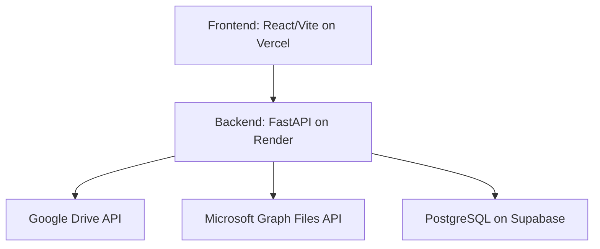

# OmniDrive: Unified Cloud Storage Pool

OmniDrive is an open-source web application designed to aggregate a user's free-tier personal cloud storage accounts (specifically Google Drive and Microsoft OneDrive) into a single, seamless, and unified virtual storage pool. 

Instead of jumping between different interfaces and managing fragmented storage limits, OmniDrive acts as a router and abstraction layer. It presents a single interface where your total available storage is the sum of your connected providers, automatically handling file chunking, distribution, and retrieval across APIs without costing a dime in infrastructure fees.

## Tech Stack 
**Database**: PostgreSQL deployed on Supabase  
**Backend**:
- Backend framework: FastAPI 
- Managing Google Drive: Google Drive API
- Managing Microsoft: Microsoft Graph Files API
- Deployed on: Render  

**Frontend**: React with Vite, deployed on Vercel  

## Architecture 

## Context Protocol
Prior to coding, feed the LLM:
- This document 
- `progress.md`
- The document for the current phase you are working on, and documents for any previous phases 

## Phases
We will eleborate more on this in separate documents. 
### Phase 1 - Skeleton
Built a working skeleton of a web app. Set up the database and include authentication for a user to log in and log out, but do nothing once they have logged in. 

### Phase 2 - Google Drive Integration
Add support for Google Drive. The end goal is that you can effectively navigate the app, as if you were using Google Drive directly. Under the hood, we will be working with the Google Drive API. 

### Phase 3 - Microsoft OneDrive Integration
Add support for Microsoft OneDrive. The end goal is that you can effectively navigate the app, as if you were using OneDrive directly. Under the hood, we will be working with the Microsoft Graph Files API. Note that at the end of the phase the user should be able to choose which one they are using. 

### Phase 4 - Unified Storage Pool
Implement the core functionality that merges the storage from both providers into a single virtual filesystem. This includes handling file chunking, automatic distribution across providers based on available space, and seamless retrieval regardless of where the file is physically stored. The user should experience this as a single, unified drive with combined storage capacity. 

### Phase 5 - Polishing (Optional)
Explore different UI styles and experiment with different AI tools to only enhance the UI, but do NOT break the functionality of the app? 