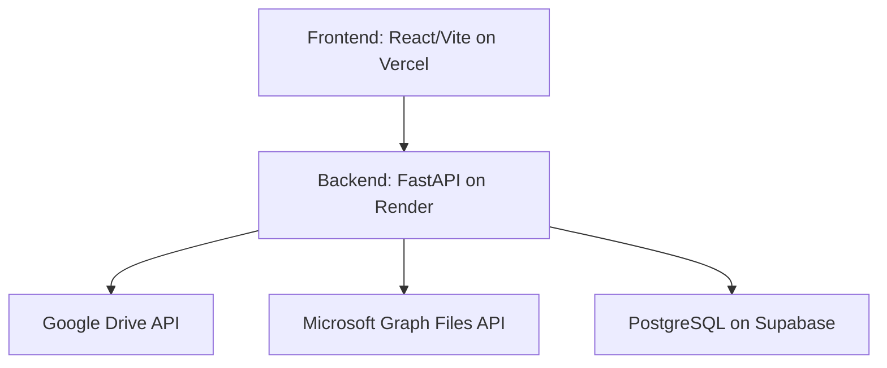

# OmniDrive: Unified Cloud Storage Pool

OmniDrive is an open-source web application designed to aggregate a user's free-tier personal cloud storage accounts (specifically Google Drive and Microsoft OneDrive) into a single, seamless, and unified virtual storage pool. 

Instead of jumping between different interfaces and managing fragmented storage limits, OmniDrive acts as a router and abstraction layer. It presents a single interface where your total available storage is the sum of your connected providers, automatically handling file chunking, distribution, and retrieval across APIs without costing a dime in infrastructure fees.

## Tech Stack 
**Database**: PostgreSQL deployed on Supabase  
**Backend**:
- Backend framework: FastAPI 
- Managing Google Drive: Google Drive API
- Managing Microsoft: Microsoft Graph Files API
- Deployed on: Render  

**Frontend**: React with Vite, deployed on Vercel  

## Architecture 

## Context Protocol
Prior to coding, feed the LLM:
- This document 
- `progress.md`
- The document for the current phase you are working on, and documents for any previous phases 